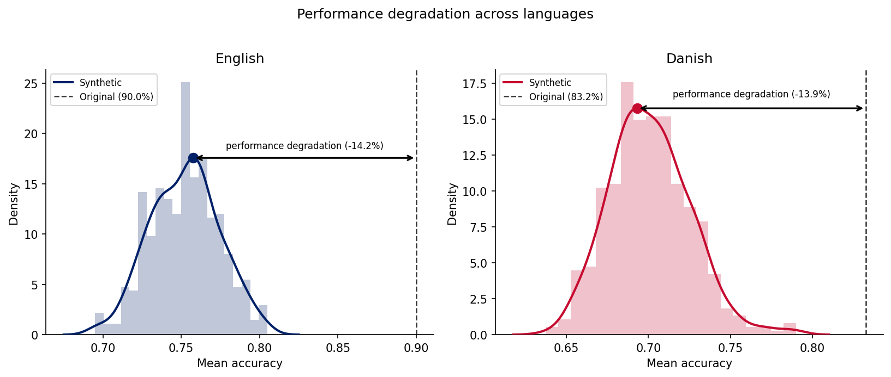
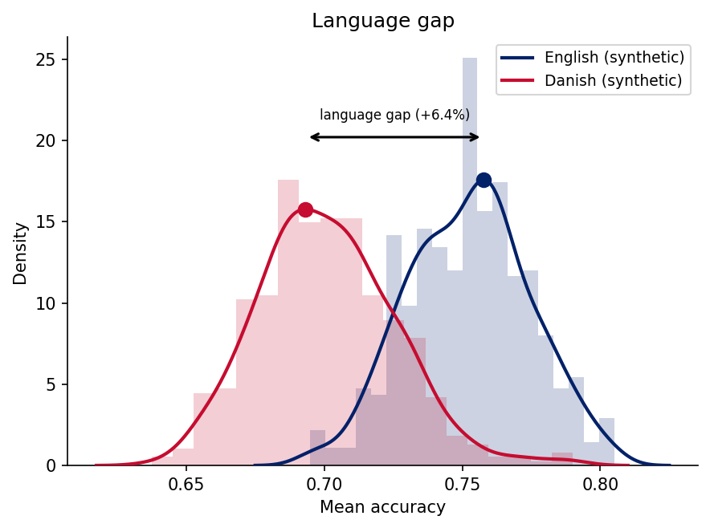
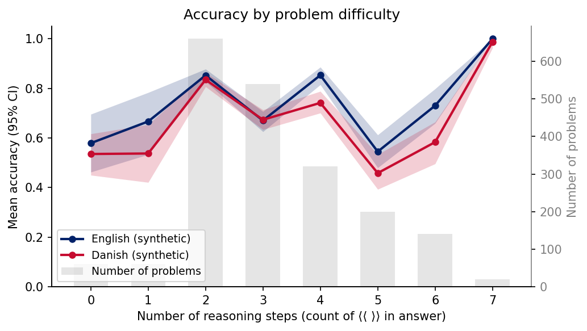

---
language:
- en
- da
- de
- is
license: mit
pretty_name: Multilingual GSM-Symbolic
size_categories:
- 1K<n<10K
tags:
- math
- reasoning
- symbolic
- multilingual
---

# Multilingual GSM-Symbolic

[](https://github.com/centre-for-humanities-computing/multilingual-gsm-symbolic)

**Multilingual GSM-Symbolic** is a benchmark for evaluating arithmetic reasoning in large language models across multiple languages. It extends Apple's [GSM-Symbolic](https://machinelearning.apple.com/research/gsm-symbolic) approach by providing symbolic templates that generate thousands of structurally equivalent but numerically distinct math problems. Templates and generation are handled by the [`multilingual-gsm-symbolic`](https://github.com/centre-for-humanities-computing/multilingual-gsm-symbolic) package.

The dataset lets you test whether a model genuinely understands a problem or merely pattern-matches on the specific numbers it saw during training. Comparing performance on `original` vs. `synthetic` splits directly measures this gap.


Want to add your own language to the dataset? It only requires validating 100 templates. Read more about how to contribute [here](https://github.com/centre-for-humanities-computing/multilingual-gsm-symbolic#want-to-add-a-new-language).

## Dataset Structure

Each language is a separate **config** (subset); each config has two **splits**:

| Split | Description |
|-------|-------------|
| `original` | The 100 concrete GSM problems for that language |
| `synthetic` | 20 generated variants per template (2 000 problems) |

Available configs: `eng`, `dan`, `nob`, `deu`, `isl`

### Fields

| Field | Type | Description |
|-------|------|-------------|
| `question` | string | The math problem |
| `answer` | string | Step-by-step solution ending with `#### <number>` |
| `target` | string | The final numeric answer (extracted from `answer`) |
| `language` | string | Three-letter language code (e.g. `eng`, `dan`) |
| `source_id` | int | Problem index in the original GSM8K dataset |

### Answer format

Answers follow the GSM8K convention — reasoning steps followed by a final numeric answer:

```
At 3 miles/hour, it will take 42/3=14 hours for the fog to cover the city.
#### 14
```

## Loading the Dataset

### With 🤗 datasets

```python
from datasets import load_dataset

# English synthetic split
eng = load_dataset("danish-foundation-models/multilingual-gsm-symbolic", name="eng", split="synthetic")

# German original split
deu = load_dataset("danish-foundation-models/multilingual-gsm-symbolic", name="deu", split="original")
```

### With inspect-ai

You can evaluate with inspect-ai simply using:

```bash
inspect eval hf/danish-foundation-models/multilingual-gsm-symbolic/synthetic_eng --model openai/gpt-5.4-nano --reasoning-effort low
```

This uses the `eval.yaml` in the repository. You can target any task id (e.g. `original_deu`, `synthetic_isl`) or omit the task name to run all languages.

## Evaluation Results

As a sanity check for the results we evaluated the model with [inspect-ai](https://inspect.ai) using `openai/gpt-5.4-nano` (reasoning effort: low).
Each split was run with 4 epochs (to estimate degree of certainty in the answers); original splits contain 100 problems × 4 epochs = 400 samples,
synthetic splits contain 2 000 problems × 4 epochs = 8 000 samples. German and Icelandic synthetic splits have fewer problems as some templates are pending human validation.

| Language | Original accuracy | Synthetic accuracy |
|----------|------------------|--------------------|
| English  | 90.0%            | 75.2%              |
| Danish   | 83.2%            | 70.2%              |
| German   | —                | —                  |
| Icelandic| —                | —                  |

The gap between `original` and `synthetic` accuracy reflects performance degradation on novel
number combinations — a proxy for how much a model relies on memorisation vs. genuine reasoning.

### Performance degradation (original → synthetic)



### Language gap (English vs. Danish, synthetic)



### Accuracy by problem difficulty (reasoning steps)




Eval logs are available in the [`logs/`](https://huggingface.co/datasets/danish-foundation-models/multilingual-gsm-symbolic/tree/main/logs) folder on this repository.

## Citation

If you use this dataset, please cite the project in which it was constructed (Danish Foundation Models) as well as the original GSM-Symbolic paper:

```bibtex
@misc{enevoldsen2023danishfoundationmodels,
      title={Danish Foundation Models}, 
      author={Kenneth Enevoldsen and Lasse Hansen and Dan S. Nielsen and Rasmus A. F. Egebæk and Søren V. Holm and Martin C. Nielsen and Martin Bernstorff and Rasmus Larsen and Peter B. Jørgensen and Malte Højmark-Bertelsen and Peter B. Vahlstrup and Per Møldrup-Dalum and Kristoffer Nielbo},
      year={2023},
      eprint={2311.07264},
      archivePrefix={arXiv},
      primaryClass={cs.CL},
      url={https://arxiv.org/abs/2311.07264}, 
}

@article{mirzadeh2024gsmsymbolic,
  title={GSM-Symbolic: Understanding the Limitations of Mathematical Reasoning in Large Language Models},
  author={Mirzadeh, Iman and others},
  year={2024}
}
```

## Acknowledgements

This dataset was developed at the [Centre for Humanities Computing](https://chc.au.dk/) by [Kenneth Enevoldsen](https://github.com/KennethEnevoldsen) using the [`multilingual-gsm-symbolic`](https://github.com/centre-for-humanities-computing/multilingual-gsm-symbolic) package.
